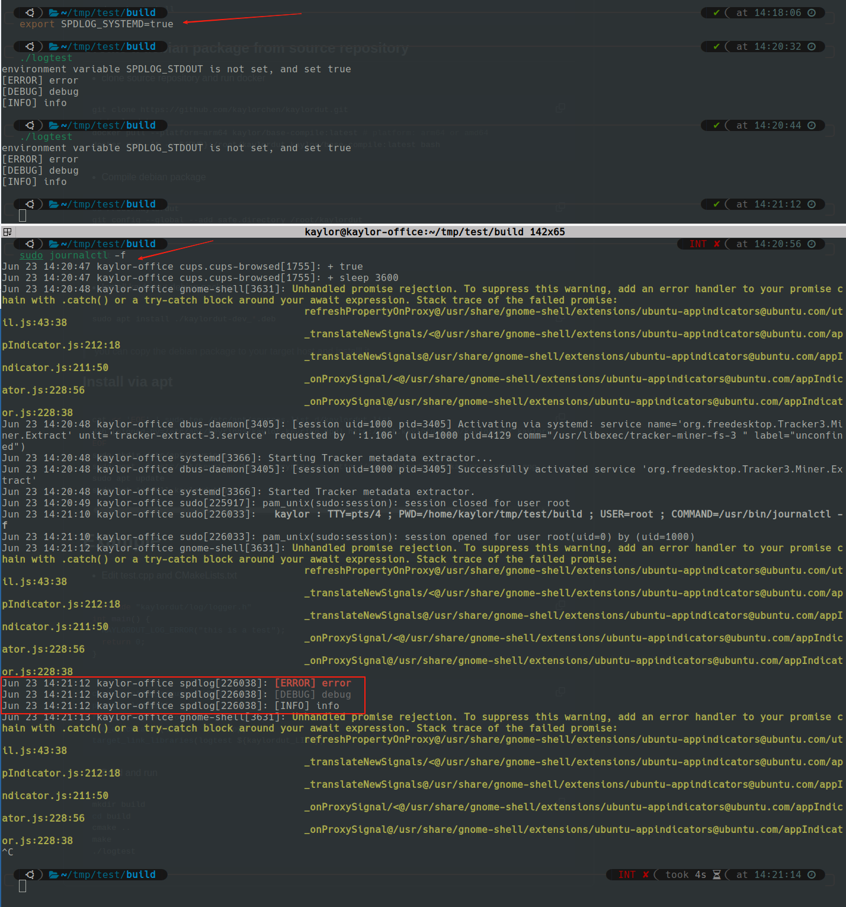

## 为什么需要规范log打印
	从开始编程的时候，大家可能接触到printf和std::cout这样的log打印函数或者方法。
	使用c库自身的打印函数固然简单，在调试阶段我们可能添加了大量的打印信息，而这些打印信息在我们需要release版本的时候，又需要我们特地把他们删除，那有没有一种方法避免这总情况呢。
	答案是，我们需要分级打印。所谓分级打印，就是将打印等级分为多个level，我们设置一个阈值，只有高于某个等级的时候，log才会打印。

## Log等级
一般的等级划分

| 等级       | 说明                         |
| -------- | -------------------------- |
| tarce    | 等级最低，一般用来打印我们不需要常用的信息      |
| debug    | 一般是打印一些不重要的数据，周期性的居多       |
| info     | 打印一下运行时的，我们关系的状态数据，偶尔触发的数据 |
| warn     | 警告，不影响运行                   |
| error    | 错误，某些功能不可用                 |
| critical | 严重错误                       |
## 使用封装的log库进行开发

这里介绍一下经过封装的spdlog库。[点击这里跳转到github开源项目](https://github.com/kaylorchen/kaylordut) 
### 安装
```bash
sudo apt install libspdlog-dev libsystemd-dev -y
git clone https://github.com/kaylorchen/kaylordut.git
mkdir -p kaylordut/build
cd kaylordut/build
cmake ..
make 
sudo make install
```
### 使用

#### 编辑一个main.c文件
```C++
#include "kaylordut/log/logger.h"
int main() {
  KAYLORDUT_LOG_ERROR("error");
  KAYLORDUT_LOG_DEBUG("debug");
  KAYLORDUT_LOG_INFO("info");
  return 0;
}
```
#### 编辑一个CMakeLists.txt文件
```cmake
cmake_minimum_required(VERSION 3.10)
project(logtest)
find_package(kaylordut REQUIRED)
add_executable(logtest main.cpp)
target_link_libraries(logtest ${kaylordut_LIBS})
```

#### 编译和运行
```bash
mkdir build
cd build
cmake ..
make 
./logtest 
```

#### 运行结果分析

> 默认的log等级是info，所以debug信息没有显示


> 设置环境变量中的SPDLOG_LEVEL的等级为debug之后， debug等级之上的log都被打印出来


> 这里我们可以看到，systemd选项打开之后。 程序的log会打印到linux系统的log中去。并且会根据log的等级显示不同的颜色。
> 这个功能在我们release产品的时候十分有用，log收集工作直接使用linux系统的systemd收集，我们只需要使用相应的指令就可以查看任何历史的log


