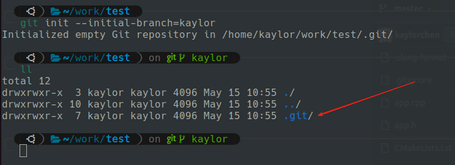
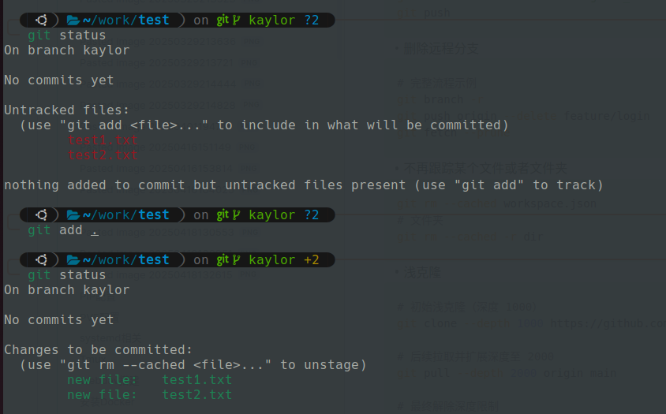
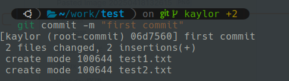
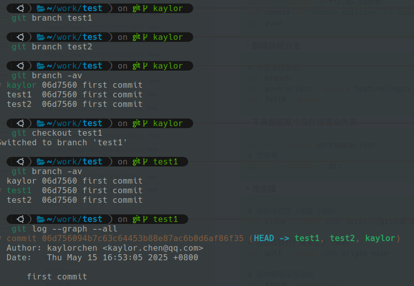
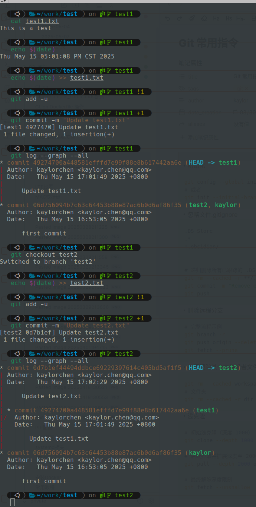
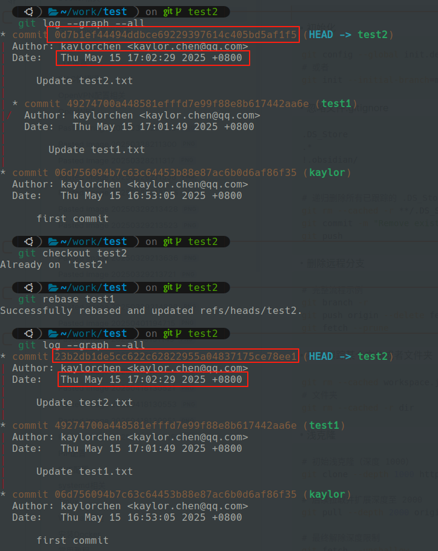
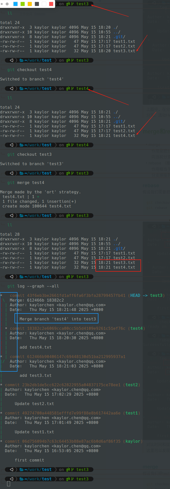

## 背景
git是一款版本管理软件，通常用来做代码和文档的版本管理，更深远的可以用来做硬件设计和机械设计的版本管理。
### 版本管理的意义
- 杜绝再出现 “最终版”， “最终最终版”, "最终究极版" 的混乱版本
- 可追溯历史，可随时切换回指定的某次提交

[Windows git命令行工具](https://git-scm.com/)
[Windows Github Desktop软件](https://desktop.github.com/download/)

## 常用指令

### 初始化一个仓库
如果你自己从零开始开发一个仓库，那你需要初始化它，运行下方的指令，会在同级目录中生成一个版本管理的隐藏文件夹 **.git**
```bash
git init
git init --initial-branch=kaylor #指定初始化的分支名是kaylor
```

### 添加需要追踪的文件
需要追踪的文件是说你如果追踪了此文件，那么它会被纳入git的版本管理中，它的改动会在git中记录下来。
```bash
git add * # 添加所有的文件
git add -u # 添加已经追踪的 并且有新的改动
git add . # 添加当前目录下的文件
```



### 提交本次更改
``` bash
git commit -m "这里加一些你自己提交说明，比如，修复某某bug"
git commit -m "a new commit msg" --amend # 如果你刚才的提交msg写错了，可以使用这个指令，覆盖那一次提交
```


### 提交示例
``` bash
git status          # 查看文件状态
git add app.js      # 暂存 app.js 文件
git commit -m "修复了app.js中的bug"  # 提交并添加说明
git push origin main  # 推送到远程仓库的main分支
```


### 生成分支和检出分支
```bash
git branch test1 # create a branch named test1 based on the current branch
git checkout test1 # switch to test1 branch
git checkout -b test1 # create a branch named test1 and switch to test1 branch
```


### 查看提交记录
```bash
git log
git log --graph --all # 所有分支，图形结构展示
```


> 上图中，在分支test1 和test2 中分别做修改。我们可以从最后的log中看到这已经是一颗树生出了分叉。活动Head指向test2

### merge和rebase

- merge 
	作用是把分叉的的分支，合并到当前分支，相当于多个车道的汇聚到一起，然后新的HEAD指向当前分支
- rebase （推荐）
	作用相当于找到当前分支和需要rebase的分支共同祖先，然后把当前分支剪下来，然后把这个分支嫁接到需要rebase的分支上
#### rebase
假设我们需要把test2 rebase test1上
```bash
git checkout test2
git rebase test1
```


> 对比时间和提交的信息我们可以看到改动应该是一样的，但是commit的hash值会不同
> 这里可以发现，rebase的意思就是在test1为基础上叠加test2的改动

#### merge
假设我们把test4 merge 到test3
```bash
git checkout test3
git merge test4
```

> 注意到原来test3和test4分支都分别有test3.txt和text4.txt, merge 之后两个文件都有。同时我们看到提交记录中两个路线汇聚到了一起

#### 总结
rebase 是一枝独秀，merge是各种汇聚。推荐使用rebase的原因是从提交记录来看，单线的提交看起来更容易分析，如果merge过多，那么看起来的提交记录会变得混乱。


### 远程仓库建立
- remote
```bash
git remote -v # 查看远程仓库等信息
git remote add origin https://gitlab.com/etherlab.org/ethercat.git # 如果本地原来没有远程仓库追踪，可以使用该指令添加远程仓库追踪。
```
其中，https://gitlab.com/etherlab.org/ethercat.git 这个地址从github仓库的连接里拷贝（下图红圈处）


当远程仓库被添加后，再次输入
```bash
git remote -v # 查看远程仓库等信息
```
会显示远程仓库：


### 首次推送远程仓库
当首次使用 git push 推送代码去远程仓库，会显示：


按照上面的提示要求输入：
```bash
 git push --set-upstream origin 分支名称
```
即可完成代码的首次上传

### 通过SSH免密登录
在git命令行中输入
```bash
ssh-keygen
```
生成密匙对
输入
```bash
cd
```
进入master文件夹
再输入
```bash
ls. ssh/
```
显示所生产的密匙对


输入
```bash
cat.ssh/密匙名
```
可以查看密匙文件


输入
```bash
cd -
```
返回上一次的根目录，
输入
```bash
$ git remote set-url origin SSH地址
```
其中，SSH地址从github网页中获取

输入
```bash
git remote
```
查看远程仓库情况


### 改写当前的追踪仓库
```bash
git remote --set-url origin https://gitlab.com/etherlab.org/ethercat.git # 如果远程仓库的链接已经存在，那么这个指令就是改写当前的追踪仓库
```
- push
```bash
git push -u origin master # 推送本地master分支到远程master分支
```
- pull / fetch
```bash
git pull # 拉取远程分支，并自动merge到当前分支

git fetch origin master # 拉取远程master的改动到本地，但是不合并
git merge origin/master # merge远程改动到本地分支， 不推荐 
git rebase origin/master # rebase远程改动到本地分支， 推荐
```

