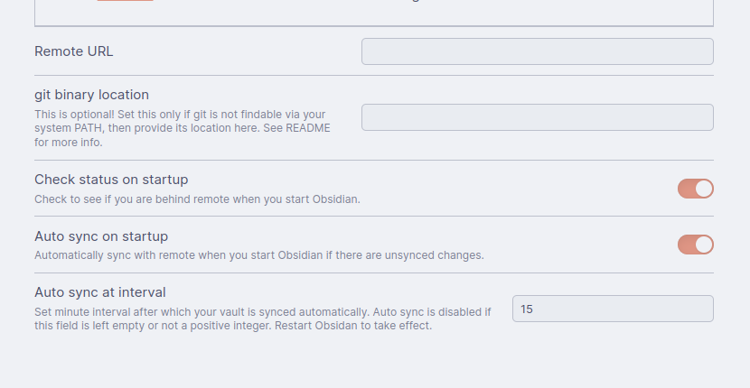

## 下载安装git命令

https://git-scm.com/downloads/win

## 从码云下载样板仓库

https://gitee.com/kaylor/obsidian-template/repository/archive/main.zip

## 解压加载仓库即可使用
-  AI插件需要查看设置中的插件设置，配置相应的API
- Ctrl+P 之调出命令行，可以根据你的需求搜索需要的功能

## 设置电脑端的同步方法

- remote url: 使用你的git仓库的url 使用ssh形式
- git binary location： 这是git可执行文件的路径，在第一步中下载安装的git scm中，Linux和Mac有默认的路径，windows有可能需要指定，如果安装的时候使用默认的安装，大概率不用专门指定

> 需要再gitee或者自己的git服务器上建立自己的知识库git仓库才可以同步。
> git自带的版本管理，所以建议使用git作为同步工具。