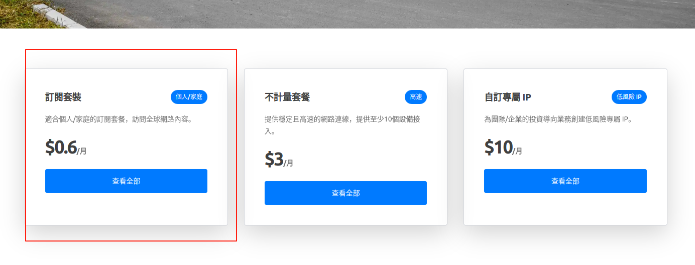
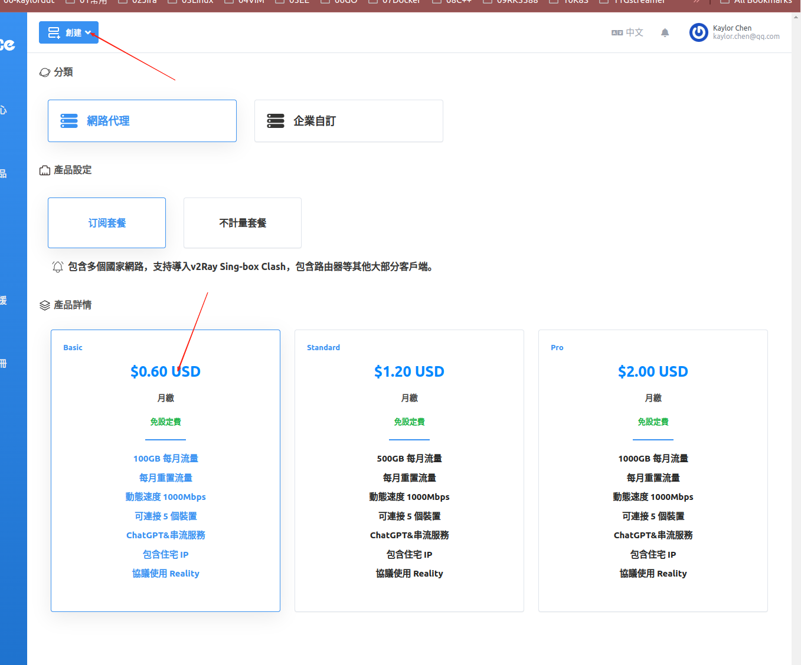
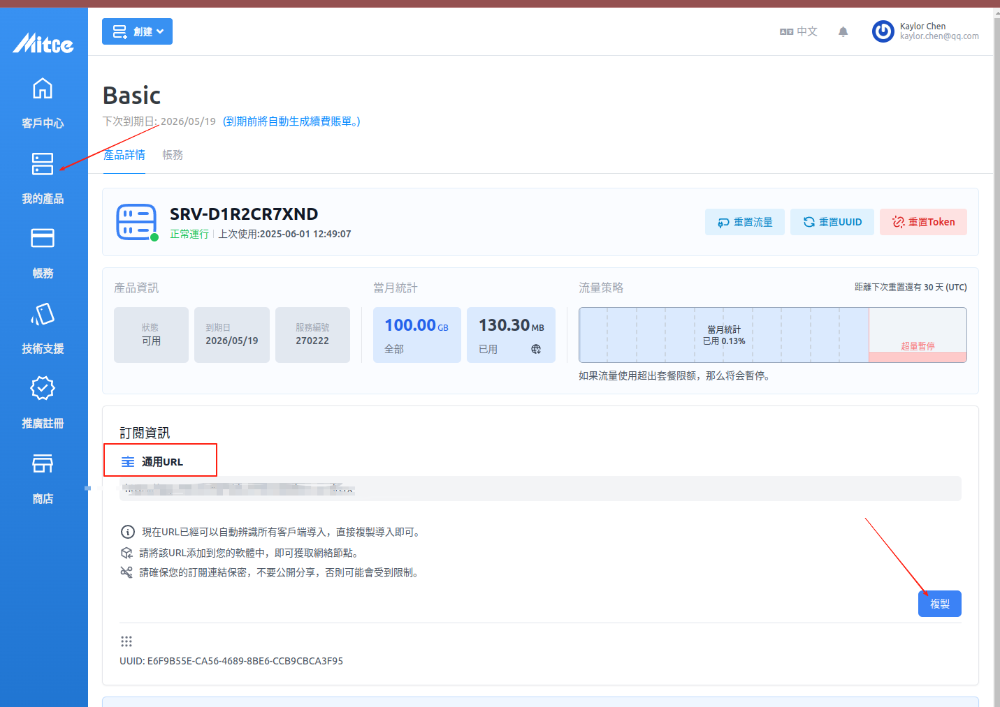
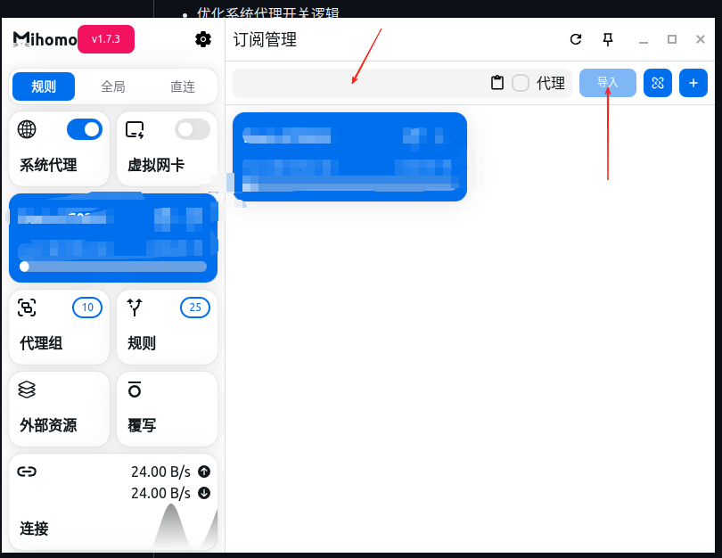
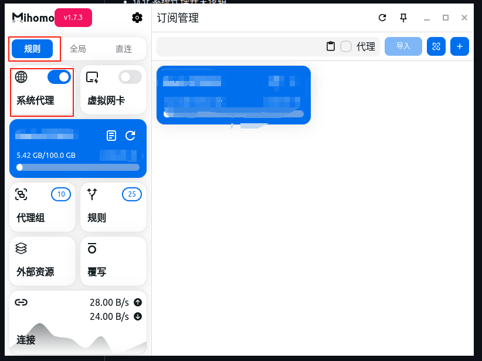
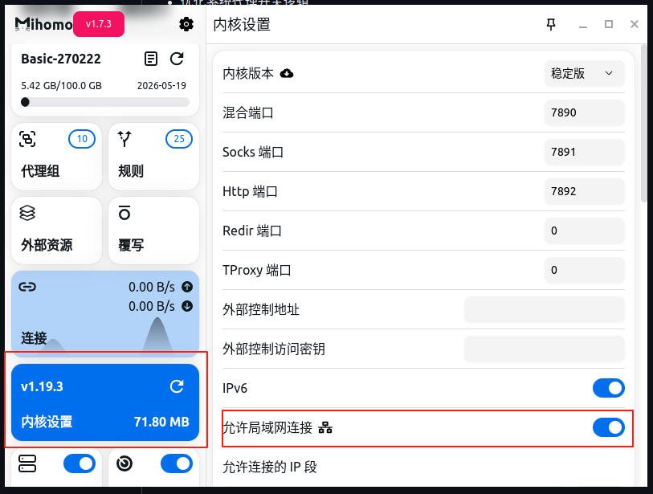
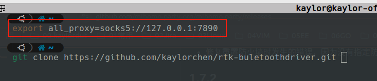

## 概念
### 机场
机场是你购买的别人搭建好的海外服务器的服务，一般来说，成熟的机场他们会提供一个订阅的网址。通过订阅的网址你可以订阅到你需要的魔法节点。
### 客户端
客户端就是安装到你电脑中的软件，可是填入订阅地址，然后简单设置就可以实现科学上网
## 购买机场
> 如果你之前已经购买过一些其他的服务，他们一般就会有提供订阅网址，可以不用再去多购买其他的服务

### 购买一个便宜的机场
[点击这里](https://mitce.net/?language=chinese), 购买一个便宜的机场，这里最便宜的套餐是一个月100G，五个设备，需要0.6刀




> 注意，这里的通用URL就是订阅地址

## 客户端设置
客户端千千万，这里推荐的客户端是mihomo，可以从github上直接下载，[请点击这里](https://github.com/mihomo-party-org/mihomo-party/releases) 。
这里的客户端有Windows Linux MacOS，下载自己需要的。
### 配置订阅




一般来说，配置订阅之后，我们设置一般会选择规则和系统代理。一般来说，这时候系统就会默认的国内走国内的线路，某些不能上网的网站就会自己走国外

### 高级设置


设置完局域网代理之后，一些情况下可以加速一些应用。比如在终端中输入：
```bash
export all_proxy=socks5://127.0.0.1:7890  # 设置局域代理
```
这个时候就可以通过代理git clone你需要的代码。

